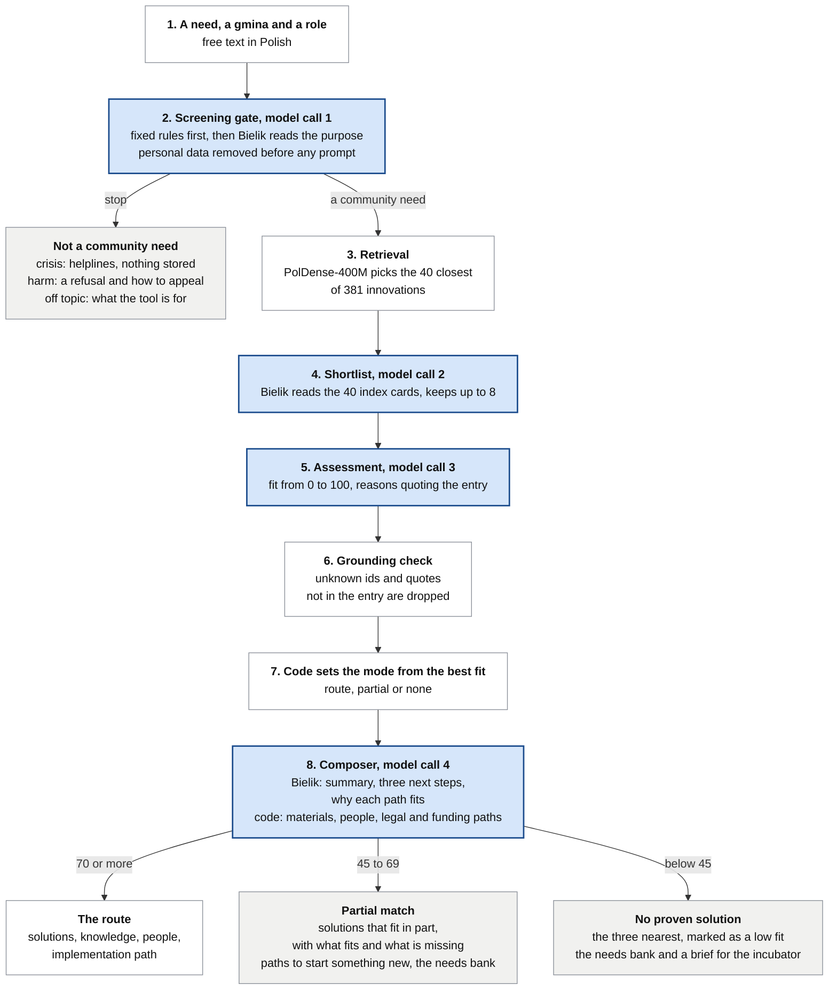
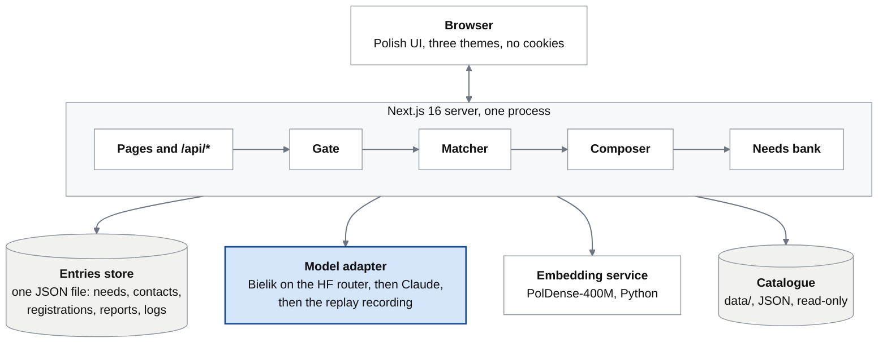

# HubMI.pl: from need to solution

A working pilot of the end-user side of HubMI.pl, the digital core that
ROPS Kraków plans for the Małopolska Social Innovation Hub, built for the
HubMI.pl partner task of HackYeah 2026. It answers the partner's
question: how do proven solutions to social problems reach the places
that need them? Around the pilot, the ROPS panel at `/rops` is built:
moderation, replies to authors, live knowledge edits and the trends of
the needs. The roles at ROPS remain a proposed roadmap.

## Live demo

The app runs at
https://router-16ce7c.polandcentral.cloudapp.azure.com/. The site is up
and running only during HackYeah 2026; afterwards, run it from a
checkout as [Quick start](#quick-start) says. The ROPS panel is at
`/rops`; its access code is given to the jury with the submission.

## What it is

A resident, a social worker, an NGO leader or a municipal official
describes a need in plain Polish and picks their municipality (gmina).
The answer is a route, not a list:

- **Solutions**: up to three proven innovations that fit, each with why
  it fits, quoted from its source entry, and what it takes: implementer,
  cost band, time and where it already runs.
- **Knowledge**: the manuals, models and videos that come with them.
- **People**: the innovator, implementers nearby, the ROPS category
  advisor and people ready to act, with consent.
- **Implementation path**: the legal vehicle, the funding calls and three
  next steps.

Beside the proven solutions, a route shows the similar cases others
brought to the tool: the needs of the needs bank and the idea cards
close to this one, with what became of them. Only the ones whose
authors consented and that ROPS approved are shown, a need in the
gate's neutral words; the others are only counted.

When nothing fits well enough, the tool says so, files the need in a
needs bank and drafts the brief for the next incubator call, with a
duplicate check against the existing innovations. Needs become the
demand signal the incubators lack today.

A person with an idea, or with a practice already tried in microscale,
fills in an idea card: what it is, its essence, whom it is for and how
far it got. The card's own page shows the proven solutions closest to
it, with what is similar and what differs, quoted from the catalogue.

Every innovation can be rated, commented on and improved, and people
and organisations can sign up to test it. Its page shows only the
numbers; the texts and the sign-ups go to ROPS, which passes them on to
the innovators.

Beyond the route, a person can talk to ROPS without an account. A
question, a request for a mentor or an answer to a partnership post
starts a conversation with a private link, remembered on the device;
ROPS answers in its panel and can invite a mentor, who gets a private
link of their own. The partnership board shows the posts ROPS approved,
from NGOs, gminas, institutions, businesses, universities and residents;
an answer goes through ROPS, so no contact is public. Nothing is sent by
e-mail, and only the hashes of the links' keys are stored.

It is not a web search: it never looks at the open internet, only at a
closed catalogue of 381 described and attributed innovations. And it is
not just RAG, a chatbot writing an answer over retrieved text: retrieval
only shortlists candidates, a screening gate runs before it, the model
only ranks and gives reasons it must quote from the source, every
identifier it returns is checked, and the route itself is assembled from
structured data (people, legal vehicles, funding calls, next steps) that
the model never writes.

The concept goes beyond the software: ROPS would run the service in
three roles (category advisor, catalogue editor, needs-bank coordinator)
and close three loops: need to implementation, need to new innovation,
innovation to places. The roles are the proposed roadmap; the panel
they would work in is built (decision R.3). It moderates every idea
card, evaluation, need, contact request, registration and content
report, answers the author of an idea on the card's own page, edits
the knowledge of the routes without a data release (verified or hidden
innovations, a corrected summary, an added film, new or edited
knowledge items), shows the trends of the needs and exports every
queue as CSV for Excel. It opens with the shared code of `ROPS_TOKEN`;
a production server without it keeps the panel locked.

Built for everyone: a Polish interface in Atkinson Hyperlegible, a
typeface designed for readers with low vision, 7:1 text contrast, three
display themes, full keyboard use, a phone layout and an axe check of
every screen. Blind users can use it with a screen reader.

## Quick start

Clone the repository and run the app in mock mode, on the prototype's
fixtures, without any data or key:

```
git clone https://github.com/bobrovsky420/hackyeah2026.git
cd hackyeah2026
npx pnpm@12.6.0 install
npx pnpm@12.6.0 dev
```

Open http://localhost:3000.

The full version, with the real catalogue, the language model and the
embeddings, is set up in [docs/quick-start.md](docs/quick-start.md).

## How a route is made



The blue steps are the four model calls of a route; everything else is
code and curated data. The gate's call is skipped when its fixed rules
already decide, and the composer's when nothing is shortlisted.

1. **The screening gate** reads every text before any matching: a
   deterministic pre-check, then the model. A community need is routed;
   signs of a crisis lead to the verified helplines and the local social
   assistance centre, not to innovations; a request meant to exclude or
   demean is declined, with a reason and a person to appeal to. Personal
   data of third parties is removed before storage and before any prompt.
2. **Retrieval**: the need is embedded with PolDense-400M and the forty
   nearest index cards of the 381 innovations are selected.
3. **Rerank and reasons**: Bielik 11B v3.0 (the Polish open model, on the
   Hugging Face router) picks the two or three that fit and explains why;
   Claude is the fallback. Every identifier the model
   returns is checked against the catalogue, every reason quotes the
   source, and generated text is labelled. The model never creates a
   solution, an organisation, a person, an amount or a deadline.
4. **The composer** adds the knowledge, the people (innovators,
   implementers nearby, the ROPS advisor, people ready to act, shown only
   with consent and after ROPS verification), the implementation paths
   (legal vehicle, funding calls) and three next steps.
5. **What is stored waits for ROPS.** Contact requests, saved needs,
   registrations, idea cards, evaluations and content reports are
   stored, and the tool sends nothing to anyone. A person at ROPS
   decides each of them in the panel at `/rops`, and every decision is
   logged with the reviewer's name. The tool never decides anything
   about an individual.

The ten ethics principles behind this (dignity, do no harm, a person in
crisis gets a person, no decisions about individuals, privacy by design,
people in the loop, fairness, honesty about the machine, accessibility
and plain language, accountability) are section 3.6 of the
[specification](docs/functional-specification.md) and the "Zasady" page
of the app.

## Architecture



- **Web app**: Next.js 16 with React, TypeScript and Tailwind CSS 4;
  forms post to route handlers under `/api`, and every Polish string
  lives in `messages/pl.json`.
- **Route pipeline** (`src/server/`): four modules, the gate, the
  matcher, the composer and the needs bank, that meet only through typed
  contracts and receive the model as a function, so each is tested
  without the network. A replay cache keeps a route stable for the same
  need.
- **Model layer** (`src/lib/llm/`): one adapter over Bielik on the
  Hugging Face router, then Claude, then recorded answers; the prompts
  are versioned files in `prompts/`.
- **Retriever**: PolDense-400M in a small Python service; when it is
  down, the matcher falls back to a lexical scorer, so the app keeps
  answering.
- **Catalogue**: built offline by the Python pipeline in `scripts/`
  from the two source catalogues and public GUS data, shipped as a
  versioned data release and read by the app through one facade. The
  record contract is [docs/innovation-record.md](docs/innovation-record.md).
- **Storage**: no database; the entries (needs, contact requests,
  registrations, reports, logs) are kept in memory and saved to one
  JSON file after every change, with retention run by the server.
- **Deployment**: one Ubuntu server on AWS Lightsail, the
  app and the embedding service as two systemd services behind Caddy
  ([docs/server-deploy.md](docs/server-deploy.md)); a laptop runs the
  same two processes from a checkout.

The requirements are in the
[functional specification](docs/functional-specification.md).

## Data, models and licences

| What | Source | Licence |
|---|---|---|
| 300 innovations | Baza innowacji społecznych, innowacjespoleczne.pl (Fundacja Stocznia) | CC BY 4.0 texts |
| 115 innovations | Biblioteka innowacji społecznych, ROPS Kraków | CC BY 4.0, or the MIIS terms of use, shown with attribution |
| The catalogue of the app | The two merged (34 duplicates joined) into 381 records with derived fields; the contract is [data/README.md](data/README.md) | as above; the catalogues stay the systems of record |
| Municipalities | The TERC register (GUS); indicators from the Local Data Bank (GUS BDL, 2024); boundaries from the PRG in the public-domain GeoJSON of waszkiewiczja | CC BY 4.0 (BDL, PRG) |
| Language models | Bielik 11B v3.0 (SpeakLeash) through the Hugging Face router; Claude (Anthropic) as the fallback | The providers' terms |
| Retriever | PolDense-400M by OPI PIB (Dadas et al. 2026, "Parameter-Efficient Retrievers for Polish and European Languages") | Gemma Terms of Use |
| Software | Next.js 16, React, TypeScript, Tailwind CSS 4, MapLibre GL JS, Lucide; form patterns from the GOV.UK Design System; a Python data pipeline | Open-source licences of the packages |
| Typeface | Atkinson Hyperlegible Next, Braille Institute | SIL Open Font License |

## How the models were chosen

Both models were chosen by measurement before the hackathon, against
other candidates, on how well they process Polish text: semantic
retrieval and matching, intent detection and the detection of emotional
distress.

- **Language model**: Bielik 11B v3.0 against Llama 3.3 70B,
  gpt-oss-120b, Qwen3.5-9B and Apertus-8B, on Polish texts to classify
  by intent and emotional state and on semantic matching, measuring
  correct answers, strict structured output, invented identifiers,
  latency and cost. Bielik was the only model right on every case,
  including those where larger generalist models failed, at a fraction
  of a cent. A review of European models and hosts with Polish support
  went with it.
- **Retriever**: PolDense-400M against PolDense-150M, three sizes of
  Qwen3 Embedding and Snowflake Arctic Embed 2, on semantic retrieval
  of Polish texts, measuring recall at 1, 10 and 40 and the mean
  reciprocal rank. On the harder query set, PolDense-400M ranked the
  right text first 92 percent of the time, against 84 percent for the
  best other family (Qwen3 Embedding 8B, twenty times its size).

## Team, credits and licence

The team: Alexander Bobrovský, Anton Myshelov, Dmytro Chernikov, Dmytro
Ushakov and Krzysztof Zając. AI coding agents (Claude Code, Anthropic)
wrote code, texts and tests under the team's direction; every Polish
text the public sees is reviewed by the team's Polish speakers, and the
idea and every decision are the team's own, recorded for review in the
[decision log](docs/decision-log.md).

The code is under the Apache License 2.0 ([LICENSE](LICENSE)); copyright
2026 the team members named above. The rules of the partner task may
provide for a transfer of economic rights to the partner; the team
accepts that if the rules say so.
